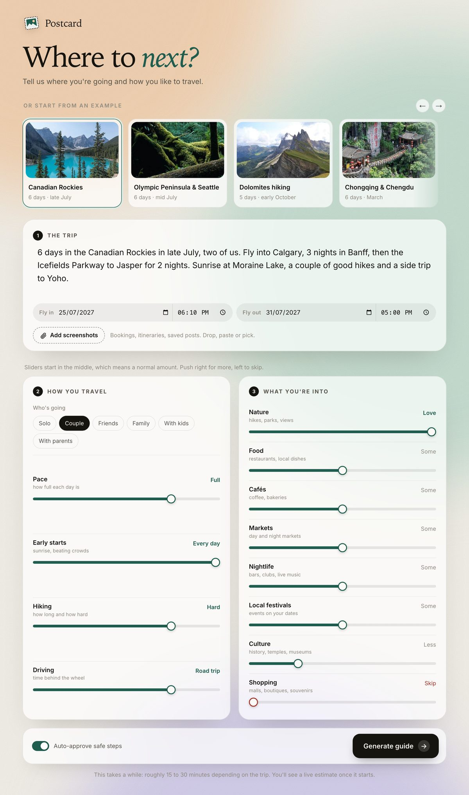
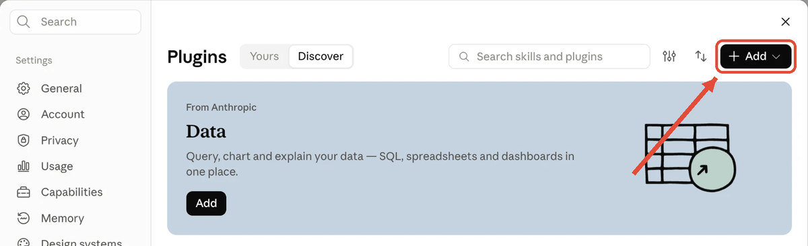
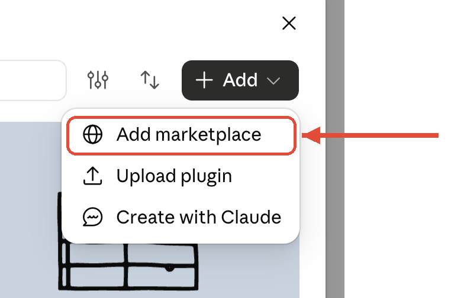
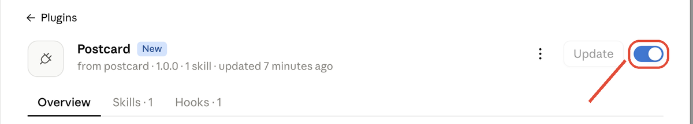

# Postcard

Describe a trip in your own words and Postcard turns it into a travel guide. Every stop gets its own tab with day plans, where to stay and what is on. Real photos and maps are built in. It works with Claude Code and with Codex, on your own plan, so there is no API key to set up.



## Get started with Claude

### 1. Install

In the Claude desktop app, go to **Settings** and open **Plugins**. Click **+ Add**.



Choose **Add marketplace**.



Paste this in and confirm:

```
jedlwk/Postcard
```

Postcard now shows up in your plugin list. Search for "Postcard" if you don't see it, then click **Add** on it.

Postcard's page opens. It says "from postcard · 1 skill", with tabs for **Overview**, **Skills · 1** and **Hooks · 1**. Check that the switch at the top right is on (blue). That's it.



**Using Claude Code in a terminal instead?** Type these into Claude Code, one at a time. They will not work in your normal shell.

```
/plugin marketplace add jedlwk/Postcard
```

```
/plugin install postcard@postcard
```

### 2. Make a guide

Start a new Claude Code session and type `/postcard:postcard`. A page opens in your browser. Describe the trip, or tap one of the examples to fill it in. Set the sliders if you like and press **Generate guide**. When it is done, download the guide from the same page.

## Get started with Codex

### 1. Install

In your terminal, add the Postcard marketplace:

```
codex plugin marketplace add jedlwk/Postcard
```

Then open Codex, type `/plugins`, pick **Postcard** and install it. Start a new session afterwards.

The ChatGPT desktop app picks up the same marketplace. Restart the app and Postcard appears in the **Plugins** tab. Click **+** to install it.

Codex asks you to review Postcard's hook before it runs. Trust it, because that hook is what lets the form page answer approvals.

**Recommended.** Codex serves cached web results by default. For current festival dates and closures, add this line to `~/.codex/config.toml`:

```
web_search = "live"
```

### 2. Make a guide

Start a new Codex session and type `$postcard`. In the ChatGPT app, type `@` and pick Postcard. The same page opens in your browser, and everything from here works the same as in Claude.

## Good to know

**Where guides are saved.** In the folder your agent is open in. With no folder open, they go to a `Postcard` folder in your home folder.

**It takes a while.** Usually 15 to 30 minutes, because it actually researches the trip. The page shows a live estimate. Keep Claude Code or Codex open until it finishes.

**Approvals in Claude.** With **Auto-approve safe steps** on, routine steps run without asking. These are web searches, reading pages and saving into your trips folder. Anything else shows up as an Allow or Deny pop-up on the same page. So does everything, if you switch the toggle off. No answer in 5 minutes counts as Deny.

**Approvals in Codex.** Codex runs most steps inside its sandbox without asking. It only asks when a step needs to leave the sandbox, such as downloading photos. While the form page is open, Postcard answers those requests with the same toggle and pop-ups. If the page is closed, Codex asks you in the chat as usual.

**It stays on your computer.** The page only runs on your own machine, with a one-time link. Postcard does nothing outside a build or outside your trips folder.

**The guide is one file.** Photos and fonts are built in. It works offline and you can email it as it is.

**Prefer chat?** Just tell your agent about the trip and it builds the guide without the form.

**You need Python 3.** Everything else installs itself.

**Getting updates.** In the Claude app, go to **Settings** and open **Plugins**, then Postcard, and click **Update**. In Codex, run `codex plugin marketplace upgrade`. Start a new session afterwards.
